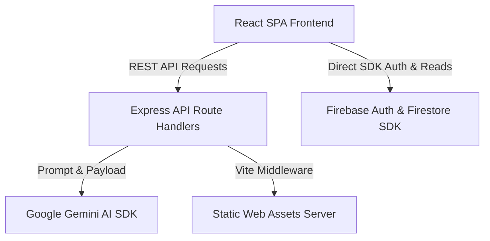

# 🖥️ SmartStudy AI - Backend Architecture & Technology Inventory

This document details the backend configurations, architectural layers, API structures, data stores, and integrations discovered within the SmartStudy AI project codebase.

---

## 🛠️ Technology Stack & Runtime

| Technology Element | Value / Description |
| :--- | :--- |
| **Programming Language** | TypeScript (`strict` compilation mode) |
| **Backend Framework** | Node.js with Express.js |
| **Runtime Environment** | Node.js (Version >= 20.0.0) |
| **Package Manager** | npm (audited via `package.json`) |
| **Module System** | ES Modules (`"type": "module"`) |

---

## 🏗️ Architectural Overview

SmartStudy AI is structured as a **monolithic full-stack application** with a layered client-server design:



### Architectural Characteristics:
1.  **Monolith Deployment**: The Express server serves both the custom REST endpoints and routes all static web client files compiled from the React single-page application.
2.  **Double-Data Layer**:
    *   **Direct-to-Client**: Authentication and subject/textbook structural reads are completed on the client side using the standard Firebase Web SDK (interacting with Firebase Auth and Cloud Firestore rules).
    *   **Server-Proxied**: High-resource AI operations are routed through the backend Express server to protect developer credentials (like `GEMINI_API_KEY`) and avoid client-side API leaking.
3.  **Vite Integration Middleware**: In developer mode, the Express app integrates the Vite development server using `vite.middlewares` to support hot module reloading (HMR) seamlessly.

---

## 🔌 API Route Architecture

The server exposes a series of **synchronous stateless REST endpoints** returning JSON responses. All routes accept `POST` payloads and are handled by the controller logic in `server.ts`.

| Endpoint | HTTP Method | Authentication | Payload Content | Purpose |
| :--- | :--- | :--- | :--- | :--- |
| `/api/gemini/summary` | `POST` | None | `{ text: string }` | Generates a structured textbook summary |
| `/api/gemini/multimodal` | `POST` | None | `{ fileData: { mimeType: string, data: base64 } }` | Processes PDF or image documents |
| `/api/gemini/quiz` | `POST` | None | `{ text: string, count?: number }` | Generates custom multiple-choice questions |
| `/api/gemini/flashcards`| `POST` | None | `{ text: string }` | Generates front/back learning flashcards |
| `/api/gemini/topics` | `POST` | None | `{ text: string }` | Extracts core learning objectives |
| `/api/gemini/explanation`| `POST` | None | `{ text: string }` | Generates simplified textbook explanations |
| `/api/gemini/chat` | `POST` | None | `{ history: array, message: string }` | Initiates tutoring session conversation |

---

## 🔑 Authentication & Authorization

### Client-Side:
*   **Provider**: Firebase Authentication.
*   **Method**: Google Sign-in OAuth2 flow.
*   **Session**: JSON Web Tokens (JWT) issued and managed automatically by Firebase Auth local sessions.

### Backend APIs:
*   **Security Posture**: **None**.
*   **Vulnerability identified**: The Express backend endpoints (e.g. `/api/gemini/*`) do not validate authorization tokens or check authentication headers. Any external client or automated script can make direct requests to the backend server and invoke LLM operations.

---

## 💾 Database & ORM / ODM

*   **Database**: **Cloud Firestore** (NoSQL Document Store).
*   **Security Enforcement**: Security rules defined in `firestore.rules` protect read/write boundaries based on user identities:
    ```javascript
    match /users/{userId} {
      allow read, write: if request.auth != null && request.auth.uid == userId;
    }
    ```
*   **ORM Layer**: There is no traditional SQL Object-Relational Mapper (like Sequelize/Hibernate). Data is queried and written using the official Google Firestore client libraries.

---

## 🚀 Additional Service Features

1.  **File Uploads**: Base64 encoded multimodal data (up to 50MB) is processed directly inside the request JSON payload for PDF/Image processing via Gemini 2.5 Flash.
2.  **External Integrations**:
    *   **SDK**: `@google/genai` (V2 SDK interface).
    *   **LLM Model**: `gemini-2.5-flash` utilized for high-speed, cost-efficient analysis.
3.  **Environment Configuration**: Loaded dynamically using `dotenv` to load secrets (e.g. `GEMINI_API_KEY`) from local `.env` storage.
